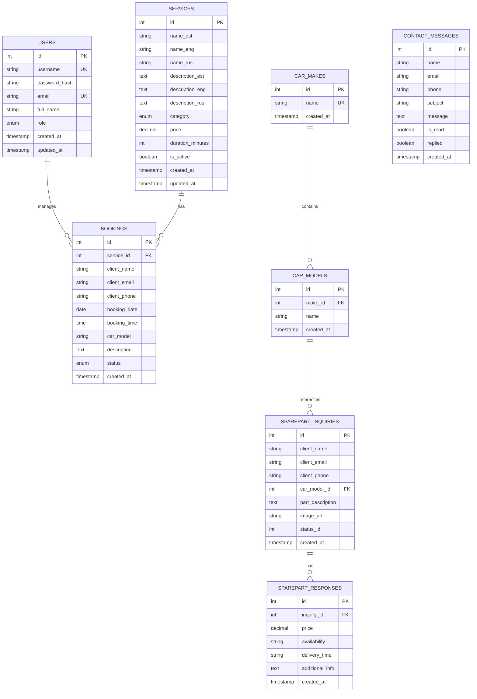

# BMA MOTORS - Auto Repair Shop Management System
## Project Design and Analysis Documentation

## 1. Introduction

### 1.1 Project Purpose and Scope

BMA MOTORS is a comprehensive web-based management system designed for an automotive repair shop specializing in BMW vehicles. The system provides end-to-end management of customer interactions, service bookings, spare parts inquiries, and administrative operations.

**Primary Goals:**
- Streamline customer service booking process
- Manage spare parts inquiries and responses
- Handle customer communications efficiently
- Provide administrative oversight and reporting
- Support multilingual operations (Estonian, English, Russian)

**Scope:**
- Online service booking with real-time availability
- Spare parts inquiry system with admin response capabilities
- Contact message management
- Service catalog management
- Admin dashboard with comprehensive reporting
- Responsive web interface for desktop and mobile devices

### 1.2 Background and Current Situation

BMA MOTORS is an established automotive repair shop with 10+ years of experience. The business previously relied on phone calls and manual booking systems, leading to:

- Inefficient booking management
- Delayed response to spare parts inquiries
- Poor tracking of customer communications
- Limited reporting capabilities
- Language barrier challenges with international clients

The new system addresses these challenges by digitizing all customer-facing and internal processes.

### 1.3 Stakeholders and Target Audience

**Primary Stakeholders:**
- **Business Owner**: Overall system oversight, business analytics
- **Shop Managers**: Day-to-day operations, booking management
- **Mechanics**: Service execution, technical consultations
- **Administrative Staff**: Customer communication, inquiry handling

**Target Users:**
- **Customers**: BMW vehicle owners seeking repair services, spare parts, or consultations
- **Administrators**: Shop staff managing bookings, inquiries, and communications
- **Potential Clients**: Visitors researching services and company information

**Geographic Focus:** Estonian market with Russian and English-speaking clientele

---

## 2. Terms and Terminology

### 2.1 Glossary

| Term | Definition |
|------|------------|
| **Booking** | A scheduled service appointment made by a customer |
| **Spare Parts Inquiry** | Customer request for specific vehicle parts with details |
| **Service** | A type of automotive repair or maintenance work offered |
| **Admin Dashboard** | Administrative interface for managing system data |
| **Time Slot** | A specific time period (30-minute intervals) available for booking |
| **JWT** | JSON Web Token - authentication mechanism |
| **CRUD** | Create, Read, Update, Delete operations |
| **API** | Application Programming Interface |
| **ER Diagram** | Entity-Relationship Diagram |
| **SPA** | Single Page Application |
| **SMTP** | Simple Mail Transfer Protocol |
| **CORS** | Cross-Origin Resource Sharing |
| **Docker** | Containerization platform |
| **MariaDB** | Open-source relational database (MySQL fork) |

### 2.2 Abbreviations

- **BMW**: Bayerische Motoren Werke (target vehicle brand)
- **UI/UX**: User Interface / User Experience
- **REST**: Representational State Transfer
- **HTTP**: HyperText Transfer Protocol
- **SSL/TLS**: Secure Sockets Layer / Transport Layer Security
- **GDPR**: General Data Protection Regulation
- **i18n**: Internationalization
- **ACC**: Adaptive Cruise Control
- **ADAS**: Advanced Driver Assistance Systems

---

## 3. Business Needs and Context

### 3.1 Problem Description

**Current Pain Points:**
1. **Manual Booking Process**: Phone-based bookings lead to scheduling conflicts and missed opportunities outside business hours
2. **Inefficient Parts Inquiry**: Email-based spare parts requests lack structure and tracking
3. **Communication Gaps**: No centralized system for customer messages and follow-ups
4. **Limited Visibility**: No real-time view of bookings, workload, or inquiry status
5. **Language Barriers**: International clients struggle with Estonian-only communication
6. **No Analytics**: Difficulty tracking business metrics and customer trends

### 3.2 Business Processes and Workflows

#### Service Booking Workflow
```
Customer Visit → Browse Services → Select Service → Choose Date/Time 
→ Provide Details → Submit Booking → Receive Confirmation (Email)
→ Admin Reviews → Approve/Modify → Customer Notification
→ Service Execution → Completion → Follow-up
```

#### Spare Parts Inquiry Workflow
```
Customer Request → Fill Inquiry Form → Submit with Vehicle Details
→ Admin Reviews → Check Availability/Price → Send Response (Email)
→ Customer Decision → Order Processing → Delivery/Pickup
```

#### Contact Message Workflow
```
Customer Message → Submit via Contact Form → Admin Dashboard Alert
→ Admin Reads Message → Mark as Read/Replied → Customer Follow-up
→ Closure/Archive
```

#### Admin Service Management Workflow
```
Admin Login → Navigate to Services Tab → Create/Edit Service
→ Add Multilingual Details → Set Category/Price/Duration
→ Activate/Deactivate → Save → Update Live Website
```

### 3.3 User and Customer Needs

**Customer Needs:**
- 24/7 online booking without phone calls
- Real-time availability visibility
- Multilingual interface (EST/ENG/RUS)
- Quick spare parts price quotes
- Easy contact and inquiry submission
- Service transparency and pricing information

**Administrative Needs:**
- Centralized booking management
- Inquiry tracking with response history
- Service catalog management
- Customer communication hub
- Business analytics and reporting
- Efficient workflow automation

### 3.4 Competition and Alternative Solutions

**Competitors:**
- **Generic Booking Systems**: Calendly, Acuity Scheduling
  - *Limitation*: Not specialized for automotive industry
- **Automotive Shop Management**: Mitchell 1, Shop-Ware
  - *Limitation*: Expensive, overly complex for small shops
- **Custom Solutions**: Proprietary systems by larger dealerships
  - *Limitation*: High development cost, vendor lock-in

**BMA MOTORS System Advantages:**
- Tailored for automotive repair shops
- Integrated spare parts inquiry system
- BMW specialization features
- Affordable and maintainable
- Multilingual support for Estonian market
- Open-source technology stack

---

## 4. Functional Requirements

### 4.1 Use Cases and User Scenarios

## User Story UC-01: View Car Repair Company Homepage

As a user  
I want to view the car repair company homepage  
So that I can understand what the company does and learn basic information about them

---

### Description

When a user visits the car repair company website for the first time, they should immediately see:
- What type of business it is (car repair workshop)
- Key company information and statistics
- Available services
- How to contact or book an appointment

---

### Acceptance Criteria

- Given user visits the car repair company homepage
- When the page loads
- Then user sees the company logo and main headline "Professionaalne autoremondi töökoda"
- And user sees company credibility statistics
- And user sees "Vaata teenuseid" and "Broneeri aeg" buttons prominently
- And navigation menu contains all main sections (Avaleht, Teenused, Broneerimime, Galerii, Värvisotsraring, Kontakt)
- And language options (EST, ENG, РУС) are visible and functional
- And user can easily access service information and contact details

---

### Story Points: 5 SP

#### Time Estimation Breakdown:
- Backend development (API endpoints for content, statistics): 2h
- Frontend development (layout, sections, styling): 3h
- Content integration (text, images, statistics): 1h
- Responsive design implementation: 1h
- Language switching setup: 1h
- Testing (frontend, backend, responsiveness): 1.5h
- Deployment to staging: 0.5h
- Total: ~10h ≈ 5 Story Points

---

### Technical Notes

- Frontend Framework: React/Next.js
- Backend Framework: Node.js/Express
- Styling: CSS/Tailwind CSS
- i18n: react-i18next for language switching
- Images: Optimized formats (WebP)
- Performance: Lazy loading for images below the fold
- API Endpoints: 
  - GET /api/homepage-content (company info, statistics)
  - GET /api/translations (language data)

---

### Dependencies

- Company logo and branding assets
- Professional car images
- Translated content (EST, ENG, РУС)
- Company statistics data
- Backend API setup

---

### Definition of Done

- All acceptance criteria met
- Backend API endpoints created and tested
- Homepage displays company identity clearly
- All statistics and information are accurate
- Navigation works on all devices
- Language switching functional
- Responsive design tested (mobile, tablet, desktop)
- Backend and frontend code reviewed and merged
- Unit and integration tests passing
- Deployed to staging environment
- Product Owner approval received

---

### Priority: High
### Sprint: Sprint 1
### Epic: Website Foundation

## User Story UC-02: View Services Page

As a user  
I want to view all available services offered by the car repair company  
So that I can understand what services are available and choose what I need

---

### Description

When a user navigates to the Services page, they should see:
- Complete list of all services categorized by type
- Service descriptions in selected language
- Pricing information for each service
- Service duration estimates
- Clear call-to-action to book a service

---

### Acceptance Criteria

- Given user navigates to the Services page
- When the page loads
- Then user sees all active services displayed
- And services are organized by categories (Engine Repair, Diagnostics, Electrical Work, Brake System, etc.)
- And each service shows name in selected language, detailed description, price in EUR, and estimated duration
- And services are grouped by categories with clear labels and visual separation
- And all service names and descriptions are displayed in selected language (EST/ENG/РУС)
- And pricing currency format matches locale
- And user sees "Broneeri" (Book) button for each service
- And clicking the button redirects to booking page with service pre-selected

---

### Story Points: 5 SP

#### Time Estimation Breakdown:
- Backend development (API endpoints for services): 2h
- Frontend development (services page layout, cards): 3h
- Category filtering and organization: 1h
- Responsive design implementation: 1h
- Multilingual content integration: 1h
- Testing (frontend, backend, responsiveness): 1.5h
- Deployment to staging: 0.5h
- Total: ~10h ≈ 5 Story Points

---

### Technical Notes

- Frontend Framework: React/Next.js
- Backend Framework: Node.js/Express
- Styling: CSS/Tailwind CSS
- i18n: react-i18next for translations
- API Endpoints:
  - GET /api/services (fetch all active services)
  - GET /api/services/category/:category (filter by category)
- Data Format: JSON with multilingual fields (name_est, name_eng, name_rus, description_est, etc.)

---

### Dependencies

- Services database populated with initial data
- Service images/icons
- Translated content for all services (EST, ENG, РУС)
- Backend API for services retrieval
- Booking page (UC-03) for integration

---

### Definition of Done

- All acceptance criteria met
- Backend API returns services correctly
- Services page displays all services with correct information
- Category organization functional
- Language switching works for all service content
- Responsive design tested (mobile, tablet, desktop)
- Book button redirects correctly to booking page
- Code reviewed and merged
- Unit and integration tests passing
- Deployed to staging environment
- Product Owner approval received

---

### Priority: High
### Sprint: Sprint 1
### Epic: Website Foundation

---

## User Story UC-03: Book a Service Appointment

As a customer  
I want to book a service appointment online  
So that I can schedule my car repair without calling the shop

---

### Description

When a customer wants to book a service, they should:
- Select an available date from a calendar
- Choose from available time slots
- Provide personal and vehicle information
- Select the type of service needed
- Receive confirmation via email

---

### Acceptance Criteria

- Given customer is on the booking page
- When the page loads
- Then customer sees a calendar with current month and dates are color-coded (green=available, yellow=partially booked, red=fully booked)
- And customer can navigate between months
- And when customer clicks on an available date, the date is selected and highlighted
- And available time slots for that date are displayed below in 30-minute intervals (e.g., 09:00, 09:30, 10:00)
- And fully booked dates and already booked time slots are not clickable/disabled
- And customer fills in required fields (full name, email, phone, car make and model, service type, additional description optional)
- And all fields have validation with proper error messages for invalid fields
- And when customer submits valid booking form, customer sees success message
- And customer receives confirmation email
- And booking is saved with "pending" status
- And admin receives notification

---

### Story Points: 8 SP

#### Time Estimation Breakdown:
- Backend development (booking API, availability logic): 4h
- Frontend development (calendar component, form): 5h
- Date/time slot availability calculation: 2h
- Form validation (client and server): 2h
- Email notification integration: 2h
- Responsive design implementation: 1.5h
- Testing (frontend, backend, E2E): 3h
- Deployment to staging: 0.5h
- Total: ~20h ≈ 8 Story Points

---

### Technical Notes

- Frontend Framework: React/Next.js
- Backend Framework: Node.js/Express
- Calendar Library: react-calendar
- Form Management: Formik + Yup validation
- Email Service: Nodemailer with Gmail SMTP
- API Endpoints:
  - GET /api/booking/available-slots?date=YYYY-MM-DD
  - GET /api/booking/month-availability?year=YYYY&month=MM
  - POST /api/booking (create booking)
- Database: MariaDB bookings table

---

### Dependencies

- Services list (UC-02) for service dropdown
- Email SMTP configuration
- Calendar component library
- Backend booking availability logic
- Database schema for bookings table

---

### Definition of Done

- All acceptance criteria met
- Calendar displays availability correctly
- Time slots are accurately calculated based on existing bookings
- Form validation works on client and server side
- Booking is saved to database with correct data
- Confirmation email sent to customer
- Admin notification sent
- Responsive design tested (mobile, tablet, desktop)
- Code reviewed and merged
- Unit and E2E tests passing (booking flow)
- Deployed to staging environment
- Product Owner approval received

---

### Priority: Critical
### Sprint: Sprint 1
### Epic: Customer Features

---

## User Story UC-04: Submit Spare Parts Inquiry

As a customer  
I want to submit a spare parts inquiry  
So that I can get a price quote for specific car parts I need

---

### Description

When a customer needs spare parts, they should:
- Fill out an inquiry form with vehicle details
- Describe the parts they need
- Upload images of parts (optional)
- Submit inquiry for admin review
- Receive response via email

---

### Acceptance Criteria

- Given customer navigates to Spare Parts page
- When the page loads
- Then customer sees inquiry form with all necessary fields
- And customer can select car make from dropdown and car model from dropdown (filtered by make)
- And customer can enter vehicle year
- And customer can enter part name/description in text field and provide additional details in text area
- And character count is displayed
- And customer can upload up to 3 images (JPG, PNG, WebP, max 5MB per image)
- And image preview is displayed after upload
- And customer provides name, email, phone number with proper validation
- And when customer clicks submit, inquiry is saved to database
- And customer sees success message
- And customer receives confirmation email
- And admin receives inquiry notification

---

### Story Points: 5 SP

#### Time Estimation Breakdown:
- Backend development (inquiry API, image upload): 3h
- Frontend development (form, image upload UI): 3h
- Car make/model dropdown integration: 1.5h
- Image upload and storage logic: 2h
- Form validation: 1.5h
- Email notification: 1h
- Testing (frontend, backend): 2h
- Deployment to staging: 0.5h
- Total: ~14.5h ≈ 5 Story Points

---

### Technical Notes

- Frontend Framework: React/Next.js
- Backend Framework: Node.js/Express
- File Upload: Multer middleware
- Image Storage: Local filesystem or cloud storage (future)
- Form Validation: Formik + Yup
- Email Service: Nodemailer
- API Endpoints:
  - GET /api/car-makes (fetch car makes)
  - GET /api/car-models?make_id=X (fetch models by make)
  - POST /api/spareparts (submit inquiry with images)
- Database: MariaDB sparepart_inquiries table

---

### Dependencies

- Car makes/models database populated
- Image upload middleware configured
- File storage solution
- Email SMTP configuration
- Admin dashboard (UC-11) for reviewing inquiries

---

### Definition of Done

- All acceptance criteria met
- Form displays and validates correctly
- Car make/model dropdowns work with correct data
- Image upload works (multiple files, size validation)
- Inquiry saved to database with all data
- Images stored securely
- Confirmation email sent to customer
- Admin notification sent
- Responsive design tested (mobile, tablet, desktop)
- Code reviewed and merged
- Unit and integration tests passing
- Deployed to staging environment
- Product Owner approval received

---

### Priority: High
### Sprint: Sprint 2
### Epic: Customer Features

---

## User Story UC-05: View Gallery

As a user  
I want to view a gallery of completed work  
So that I can see the quality of services provided

---

### Description

When a user visits the Gallery page, they should:
- See a collection of images showcasing completed repair work
- View images in organized layout
- Click on images to view in full size
- Navigate through images easily

---

### Acceptance Criteria

- Given user navigates to Gallery page
- When the page loads
- Then user sees a grid of images in responsive layout (3-4 columns on desktop, 2 on tablet, 1 on mobile)
- And images are optimized for web (WebP format) and maintain aspect ratio
- And lazy loading is implemented for performance
- And when user clicks on an image, image opens in full-screen lightbox/modal
- And user can navigate to next/previous images with arrows
- And user can close lightbox with X button or ESC key
- And user sees image caption/description and service type tag (if available)
- And user sees loading skeleton/spinner while images load progressively

---

### Story Points: 3 SP

#### Time Estimation Breakdown:
- Backend development (gallery API): 1.5h
- Frontend development (gallery grid, lightbox): 3h
- Image optimization and lazy loading: 1.5h
- Lightbox navigation implementation: 1.5h
- Responsive design: 1h
- Testing: 1.5h
- Deployment to staging: 0.5h
- Total: ~10.5h ≈ 3 Story Points

---

### Technical Notes

- Frontend Framework: React/Next.js
- Lightbox Library: react-image-lightbox or custom implementation
- Styling: CSS/Tailwind CSS
- Image Optimization: WebP format, Next.js Image component
- Lazy Loading: Intersection Observer API
- API Endpoints:
  - GET /api/gallery (fetch all gallery images)
- Database: MariaDB gallery table (optional) or static image files

---

### Dependencies

- Gallery images provided by client
- Image optimization tools
- Lightbox component library
- Backend API for gallery (if dynamic) or static file hosting

---

### Definition of Done

- All acceptance criteria met
- Gallery displays images in responsive grid
- Images are optimized and load quickly
- Lightbox opens and closes correctly
- Navigation between images works
- Lazy loading implemented
- Responsive design tested (mobile, tablet, desktop)
- Code reviewed and merged
- Performance tested (Lighthouse score > 90)
- Deployed to staging environment
- Product Owner approval received

---

### Priority: Medium
### Sprint: Sprint 2
### Epic: Website Foundation

---

## User Story UC-06: Send Contact Message

As a user  
I want to send a message to the car repair company  
So that I can ask questions or request information

---

### Description

When a user wants to contact the company, they should:
- Fill out a contact form with their information
- Write their message or question
- Submit the form
- Receive confirmation that message was sent
- Admin receives the message for follow-up

---

### Acceptance Criteria

- Given user navigates to Contact page
- When the page loads
- Then user sees contact form with required fields (full name, email, phone, subject, message)
- And user sees company contact information (address, phone, email)
- And all fields have proper labels and placeholders
- And when user submits the form, system validates all required fields are filled
- And email format, phone format, and message length (at least 10 characters) are validated
- And error messages displayed for invalid fields
- And when user submits valid form, message is saved to database
- And user sees success notification
- And user receives confirmation email
- And admin receives notification email with message details
- And form fields are cleared after successful submission

---

### Story Points: 3 SP

#### Time Estimation Breakdown:
- Backend development (contact message API): 2h
- Frontend development (contact form): 2h
- Form validation (client and server): 1.5h
- Email notification setup: 1.5h
- Responsive design: 1h
- Testing: 1.5h
- Deployment to staging: 0.5h
- Total: ~10h ≈ 3 Story Points

---

### Technical Notes

- Frontend Framework: React/Next.js
- Backend Framework: Node.js/Express
- Form Management: Formik + Yup validation
- Email Service: Nodemailer
- Styling: CSS/Tailwind CSS
- API Endpoints:
  - POST /api/contact (submit contact message)
- Database: MariaDB contact_messages table

---

### Dependencies

- Email SMTP configuration
- Contact form validation library
- Backend API for message storage
- Admin dashboard (UC-12) for viewing messages

---

### Definition of Done

- All acceptance criteria met
- Contact form displays correctly
- Form validation works on client and server
- Message saved to database
- Confirmation email sent to user
- Admin notification email sent
- Form resets after successful submission
- Responsive design tested (mobile, tablet, desktop)
- Code reviewed and merged
- Unit and integration tests passing
- Deployed to staging environment
- Product Owner approval received

---

### Priority: Medium
### Sprint: Sprint 2
### Epic: Customer Features

---

## User Story UC-07: Switch Language

As a user  
I want to switch the website language  
So that I can view content in my preferred language (Estonian, English, or Russian)

---

### Description

Users should be able to:
- See language options in the navigation bar
- Switch between EST, ENG, and РУС
- Have all website content update to selected language
- Have language preference persist during session

---

### Acceptance Criteria

- Given user is on any page
- When user views the navigation bar
- Then user sees language options (EST, ENG, РУС) with current language highlighted/active
- And when user clicks on a language option, the entire website content updates to selected language
- And navigation menu, all page content, buttons and labels update
- And all static content and dynamic content (services, bookings, etc.) displays in selected language
- And date/time formats match locale
- And selected language persists across all pages
- And language preference is stored in browser (localStorage or cookie)
- And new users see website defaulting to Estonian (EST)
- And user can change language at any time

---

### Story Points: 3 SP

#### Time Estimation Breakdown:
- Backend development (translation API if needed): 1h
- Frontend i18n setup and configuration: 2h
- Translation files creation (EST, ENG, РУС): 3h
- Language switcher component: 1.5h
- localStorage/cookie integration: 1h
- Testing all pages in 3 languages: 2h
- Deployment to staging: 0.5h
- Total: ~11h ≈ 3 Story Points

---

### Technical Notes

- Frontend Framework: React/Next.js
- i18n Library: react-i18next
- Translation Files: JSON format (en.json, et.json, ru.json)
- Storage: localStorage or cookies for language preference
- Locale Formatting: date-fns or Intl API for date/time
- Fallback: Default to Estonian if translation missing

---

### Dependencies

- All website content translated to 3 languages
- Translation files organized by namespace (common, home, services, booking, etc.)
- Native speakers for translation review
- i18n library installed and configured

---

### Definition of Done

- All acceptance criteria met
- Language switcher functional in navigation
- All pages support 3 languages
- Translation files complete for all content
- Language preference persists in browser
- No missing translations (fallback to Estonian)
- Date/time formatting matches locale
- Responsive design maintained in all languages
- Code reviewed and merged
- Tested on all pages in 3 languages
- Deployed to staging environment
- Product Owner approval received

---

### Priority: High
### Sprint: Sprint 1
### Epic: Website Foundation

## User Story UC-08: Admin Login

As an admin  
I want to log in to the admin panel by navigating to /admin  
So that I can access administrative features securely

---

### Description

Admin accesses the admin panel by:
- Navigating to http://bmamotors.ee/admin in browser
- Entering username and password in login form
- Being authenticated and redirected to admin dashboard
- Seeing admin UI overlay on top of main website
- Being logged out automatically when navigating to public pages

---

### Acceptance Criteria

- Given admin wants to access admin features
- When admin navigates to /admin URL directly
- Then login form is displayed as modal/overlay with main website navigation visible in background
- And admin sees username field, password field, and "Login" button
- And password field has show/hide toggle icon
- And when admin submits login form, system validates username and password are not empty
- And error messages displayed for empty fields
- And when admin submits valid credentials, JWT token is generated and stored (HTTP-only cookie)
- And admin is redirected to /admin/dashboard
- And admin dashboard UI is displayed with navigation sections (Broneeringud, Varuosapäringud, Sõnumid, Teenused)
- And session persists for 7 days
- And when admin submits invalid credentials, error message "Vale kasutajanimi või parool" is displayed
- And admin remains on login page
- And rate limiting applied (5 attempts per 15 minutes)
- And when admin is already logged in and navigates to /admin URL, admin is redirected to /admin/dashboard automatically
- And when admin clicks on public navigation links (Avaleht, Teenused, Broneerimime, etc.), admin is logged out automatically
- And admin session is cleared and admin is redirected to public page

---

### Story Points: 5 SP

#### Time Estimation Breakdown:
- Backend development (authentication API, JWT): 3h
- Frontend development (login modal/form): 2.5h
- JWT token generation and storage: 1.5h
- Rate limiting implementation: 1h
- Password hashing (bcrypt): 1h
- Auto-logout on public navigation: 2h
- Session management: 1h
- Testing (authentication flow, auto-logout): 2.5h
- Deployment to staging: 0.5h
- Total: ~15h ≈ 5 Story Points

---

### Technical Notes

- Frontend Framework: React/Next.js
- Backend Framework: Node.js/Express
- Authentication: JWT (JSON Web Token)
- Password Hashing: bcryptjs (10 salt rounds)
- Token Storage: HTTP-only cookies
- Token Expiration: 7 days
- Rate Limiting: express-rate-limit (5 attempts/15 min)
- Navigation Interceptor: React Router onNavigate hook to detect public page navigation
- API Endpoints:
  - POST /api/auth/login (authenticate user)
  - POST /api/auth/logout (clear session)
  - GET /api/auth/verify (verify token validity)
- Middleware: authMiddleware for protected routes

---

### Dependencies

- Users table in database with hashed passwords
- JWT secret in environment variables
- Rate limiting middleware
- Protected route middleware
- Navigation guard for auto-logout
- Admin dashboard (UC-09)

---

### Definition of Done

- All acceptance criteria met
- Admin can access login via /admin URL
- Login form displays and validates correctly
- Authentication works with correct credentials
- JWT token generated and stored securely
- Invalid credentials show error message
- Rate limiting prevents brute force attacks
- Admin redirected to dashboard after login
- Admin automatically logged out when clicking public navigation
- Session cleared on logout
- Code reviewed and merged
- Security tested (no plain text passwords, secure token storage)
- Unit and integration tests passing
- Auto-logout functionality tested
- Deployed to staging environment
- Product Owner approval received

---

### Priority: Critical
### Sprint: Sprint 1
### Epic: Admin Features

---

## User Story UC-09: View Admin Dashboard

As an admin  
I want to view the admin dashboard after logging in  
So that I can see an overview of bookings, inquiries, and messages

---

### Description

When admin successfully logs in, they see:
- Admin Dashboard with statistics cards showing key metrics
- Today's Bookings count (Broneeringud Täna)
- New Inquiries count (Uued päringud)
- Total Bookings count (Ootel broneeringud)
- Unread Messages count (Sõnumid)
- Tabs to navigate between sections: Broneeringud, Varuosapäringud, Sõnumid, Teenused
- Logout button (Logi välja) in top right
- Main website navigation still visible at top

---

### Acceptance Criteria

- Given admin has successfully logged in
- When authentication completes
- Then admin is redirected to /admin/dashboard
- And dashboard page loads with admin UI
- And admin sees 4 statistics cards ("Broneeringud (Täna)", "Uued päringud", "Ootel broneeringud", "Sõnumid")
- And each card displays current count with large number and distinct colors (blue, light blue, orange, etc.)
- And admin sees horizontal tabs (Broneeringud, Varuosapäringud, Sõnumid, Teenused) with counts
- And active tab is highlighted with blue underline
- And clicking each tab navigates to respective section
- And when admin clicks "Logi välja" (Logout) button in top right, admin session is cleared
- And admin is redirected to homepage
- And main website navigation is visible at top (Avaleht, Teenused, Broneerimime, Galerii, etc.)
- And language switcher (EST, ENG, РУС) and BMA logo are visible
- And when unauthenticated user tries to access /admin/dashboard, user is redirected to /admin login page

---

### Story Points: 5 SP

#### Time Estimation Breakdown:
- Backend development (dashboard statistics API): 3h
- Frontend development (dashboard layout, cards, tabs): 4h
- Statistics calculation and database queries: 2h
- Navigation tabs with counts: 1.5h
- Logout functionality: 1h
- Main navigation integration: 1h
- Testing (dashboard, protected routes, logout): 2h
- Deployment to staging: 0.5h
- Total: ~15h ≈ 5 SP

---

### Technical Notes

- Frontend Framework: React/Next.js
- Backend Framework: Node.js/Express
- Styling: CSS/Tailwind CSS to match screenshot design
- State Management: React hooks (useState, useEffect)
- Authentication: JWT verification middleware
- API Endpoints:
  - GET /api/admin/dashboard (fetch all statistics)
- Database Queries: 
  - COUNT bookings WHERE booking_date = TODAY()
  - COUNT bookings WHERE status = 'pending'
  - COUNT sparepart_inquiries WHERE status = 'new'
  - COUNT contact_messages WHERE is_read = false
  - COUNT services total

---

### Dependencies

- Admin authentication (UC-08)
- Database with bookings, inquiries, messages, services data
- Protected route middleware
- Navigation tabs component
- Statistics calculation logic
- Logout functionality

---

### Definition of Done

- All acceptance criteria met
- Dashboard displays all 4 statistics cards correctly
- Statistics show accurate real-time counts
- Navigation tabs functional with correct counts
- Active tab highlighted correctly
- Logout button clears session and redirects
- Main navigation visible and functional
- Protected route redirects unauthenticated users
- Responsive design tested
- Code reviewed and merged
- Unit and integration tests passing
- Deployed to staging environment
- Product Owner approval received

---

### Priority: Critical
### Sprint: Sprint 1
### Epic: Admin Features

---

## User Story UC-10: Manage Bookings

As an admin  
I want to view and manage customer bookings from admin dashboard  
So that I can confirm, update, or delete appointments

---

### Description

When admin clicks "Broneeringud" tab in dashboard, they see:
- Table with all bookings showing ID, Client name, Contact, Date/Time, Car, Status, Actions
- "Uuenda" (Add new) button to manually create booking
- Status dropdown to change booking status (Ootel = Pending, etc.)
- "Kustuta" (Delete) button for each booking
- Ability to filter and search bookings

---

### Acceptance Criteria

- Given admin is on admin dashboard
- When admin clicks "Broneeringud" tab
- Then bookings table is displayed with columns (ID, Klient, Kontakt, Kuupäev, Aeg, Auto, Staatus, Toimingud)
- And tab shows count in parentheses (e.g., "Broneeringud (3)")
- And all bookings are displayed with ID, client name, contact info, date, time, car model, status dropdown, and delete button
- And when admin clicks blue "Uuenda" (Add new) button, booking creation form/modal opens
- And admin can fill in booking details manually
- And when admin clicks on a booking row, modal/detail panel opens displaying all booking information
- And when admin clicks status dropdown (yellow "Ootel" tag), dropdown shows status options (Ootel, Kinnitatud, Lõpetatud, Tühistatud)
- And admin selects new status, booking status updates in database
- And status tag color changes and customer receives status update email (optional)
- And when admin clicks red "Kustuta" (Delete) button, confirmation dialog appears
- And if admin confirms, booking is deleted from database
- And booking disappears from table with success notification displayed

---

### Story Points: 8 SP

#### Time Estimation Breakdown:
- Backend development (bookings CRUD API): 4h
- Frontend development (table matching screenshot design): 5h
- Status dropdown component with color tags: 2h
- Add booking modal/form: 2h
- Delete confirmation dialog: 1h
- Email notifications for status updates: 1.5h
- Testing (CRUD operations): 3h
- Deployment to staging: 0.5h
- Total: ~19h ≈ 8 SP

---

### Technical Notes

- Frontend Framework: React/Next.js
- Backend Framework: Node.js/Express
- Table Component: Custom styled to match screenshot
- Styling: CSS/Tailwind CSS
- Status Tags: Yellow for "Ootel", Green for "Kinnitatud", etc.
- Email Service: Nodemailer for status updates (optional)
- API Endpoints:
  - GET /api/admin/broneeringud (fetch all bookings)
  - GET /api/admin/broneeringud/:id (fetch single booking)
  - POST /api/admin/broneeringud (create booking manually)
  - PUT /api/admin/broneeringud/:id (update booking status)
  - DELETE /api/admin/broneeringud/:id (delete booking)
- Database: MariaDB bookings table

---

### Dependencies

- Admin authentication (UC-08)
- Admin dashboard with tabs (UC-09)
- Email SMTP for notifications
- Bookings database table
- Protected API routes

---

### Definition of Done

- All acceptance criteria met
- Bookings table matches screenshot design
- Table displays all bookings with correct columns
- "Uuenda" button opens booking creation form
- Status dropdown works and updates database
- Status tag colors change based on status
- Delete button works with confirmation dialog
- Customer email sent on status update (if implemented)
- Responsive design tested
- Code reviewed and merged
- Unit and integration tests passing
- E2E test for booking management flow
- Deployed to staging environment
- Product Owner approval received

---

### Priority: Critical
### Sprint: Sprint 2
### Epic: Admin Features

---

## User Story UC-11: Respond to Spare Parts Inquiries

As an admin  
I want to respond to spare parts inquiries from admin dashboard  
So that I can provide price quotes and availability to customers

---

### Description

When admin clicks "Varuosapäringud" tab, they see:
- Table with all spare parts inquiries
- Inquiry details including customer info, car details, part description
- Form to respond with price quote and availability
- Ability to update inquiry status
- Send response via email to customer

---

### Acceptance Criteria

- Given admin is on admin dashboard
- When admin clicks "Varuosapäringud" tab
- Then inquiries table is displayed with tab showing count (e.g., "Varuosapäringud (4)")
- And table shows ID, Customer Name, Car Model, Part Description, Status, Date, Actions
- And all inquiries are displayed with ID number, customer name, contact info, car make and model, part description, status (Uus, Vastatud, Suletud), submission date, and View/Respond button
- And when admin clicks "Vaata" (View) button or inquiry row, modal/detail panel opens displaying complete information
- And when inquiry has uploaded images, admin sees image thumbnails
- And clicking thumbnail opens full-size image in lightbox and admin can navigate between multiple images
- And when admin clicks "Vasta" (Respond) button, response form appears with fields (Hind, Saadavus dropdown, Tarneaeg, Lisainfo)
- And admin fills form and clicks "Saada vastus" (Send response)
- And response data is saved to database and email is sent to customer with price quote, availability status, delivery time, additional information, and contact details
- And inquiry status automatically updated to "Vastatud" (Responded) with success notification "Vastus saadetud" displayed
- And when admin changes status dropdown manually, status updates in database immediately and status badge color changes

---

### Story Points: 5 SP

#### Time Estimation Breakdown:
- Backend development (inquiries API, response): 3h
- Frontend development (table, detail view, response form): 4h
- Image viewing lightbox: 1.5h
- Email response template and sending: 2h
- Status update logic: 1h
- Testing (inquiry management, email): 2.5h
- Deployment to staging: 0.5h
- Total: ~14.5h ≈ 5 SP

---

### Technical Notes

- Frontend Framework: React/Next.js
- Backend Framework: Node.js/Express
- Image Viewer: react-image-lightbox or custom modal
- Styling: CSS/Tailwind CSS matching admin panel design
- Email Service: Nodemailer for response emails
- File Storage: Local filesystem or cloud storage
- API Endpoints:
  - GET /api/admin/paringud (fetch all inquiries)
  - GET /api/admin/paringud/:id (fetch single inquiry)
  - POST /api/admin/paringud/:id/vastus (submit response)
  - PUT /api/admin/paringud/:id (update status)
- Database: MariaDB sparepart_inquiries, sparepart_responses tables

---

### Dependencies

- Admin authentication (UC-08)
- Admin dashboard with tabs (UC-09)
- Email SMTP configuration
- Spare parts inquiry submission (UC-04)
- Image storage system
- Protected API routes

---

### Definition of Done

- All acceptance criteria met
- Inquiries table displays all inquiries correctly
- Inquiry details show complete information
- Uploaded images display and open in lightbox
- Response form validates all fields
- Response email sent successfully to customer
- Email template is professional and in Estonian
- Status updates save correctly
- Responsive design tested
- Code reviewed and merged
- Unit and integration tests passing
- Email sending tested
- Deployed to staging environment
- Product Owner approval received

---

### Priority: High
### Sprint: Sprint 2
### Epic: Admin Features

---

## User Story UC-12: Manage Contact Messages

As an admin  
I want to view and manage contact messages from admin dashboard  
So that I can respond to customer inquiries and track communications

---

### Description

When admin clicks "Sõnumid" tab, they see:
- Table with all contact messages
- Message details
- Mark messages as read/unread
- Reply to messages via email
- Delete messages

---

### Acceptance Criteria

- Given admin is on admin dashboard
- When admin clicks "Sõnumid" tab
- Then messages table is displayed with tab showing count (e.g., "Sõnumid (1)")
- And table shows ID, Nimi (Name), E-post (Email), Teema (Subject), Kuupäev (Date), Staatus (Status), Toimingud (Actions)
- And all contact messages are displayed with message ID, customer name, email, subject line, submission date, status badge (Lugemata/Loetud/Vastatud), and actions (View, Reply, Delete)
- And unread messages are visually highlighted (bold or colored badge)
- And when admin clicks "Vaata" (View) button or message row, modal/detail panel opens displaying full message details
- And message is automatically marked as "Loetud" (Read)
- And unread count in "Sõnumid" tab decreases by 1 and status badge changes from "Lugemata" to "Loetud"
- And when admin clicks "Vasta" (Reply) button in message details, email compose form/modal appears with pre-filled customer email and subject
- And admin writes response and clicks "Saada" (Send)
- And email is sent to customer and message marked as "Vastatud" (Replied) with success notification "E-kiri saadetud" displayed
- And when admin clicks "Kustuta" (Delete) button, confirmation dialog appears
- And if admin confirms, message is deleted from database and removed from table with success notification displayed

---

### Story Points: 5 SP

#### Time Estimation Breakdown:
- Backend development (messages API, reply): 3h
- Frontend development (table, reply form): 4h
- Auto mark as read logic: 1h
- Email reply functionality: 2h
- Delete confirmation: 1h
- Status badges styling: 1h
- Testing (message management, email): 2h
- Deployment to staging: 0.5h
- Total: ~14.5h ≈ 5 SP

---

### Technical Notes

- Frontend Framework: React/Next.js
- Backend Framework: Node.js/Express
- Styling: CSS/Tailwind CSS
- Status Badges: Different colors for Lugemata/Loetud/Vastatud
- Email Service: Nodemailer for replies
- API Endpoints:
  - GET /api/admin/sonumid (fetch all messages)
  - GET /api/admin/sonumid/:id (fetch single message)
  - PUT /api/admin/sonumid/:id (update read/replied status)
  - POST /api/admin/sonumid/:id/reply (send reply email)
  - DELETE /api/admin/sonumid/:id (delete message)
- Database: MariaDB contact_messages table

---

### Dependencies

- Admin authentication (UC-08)
- Admin dashboard with tabs (UC-09)
- Email SMTP configuration
- Contact message submission (UC-06)
- Protected API routes

---

### Definition of Done

- All acceptance criteria met
- Messages table displays all messages correctly
- Unread messages visually highlighted
- Message details display complete information
- Mark as read automatically updates status
- Reply form sends email successfully
- Delete functionality works with confirmation
- Status badges display correct colors
- Responsive design tested
- Code reviewed and merged
- Unit and integration tests passing
- Email reply tested
- Deployed to staging environment
- Product Owner approval received

---

### Priority: Medium
### Sprint: Sprint 2
### Epic: Admin Features

---

## User Story UC-13: Manage Services (CRUD)

As an admin  
I want to create, view, update, and delete services from admin dashboard  
So that I can maintain the service catalog offered to customers

---

### Description

When admin clicks "Teenused" tab, they see:
- Table with all services (active and inactive)
- Button to add new service
- Edit existing services with multilingual content
- Activate/deactivate services
- Delete services
- Services organized by category

---

### Acceptance Criteria

- Given admin is on admin dashboard
- When admin clicks "Teenused" tab
- Then services table is displayed with tab showing total count (e.g., "Teenused (21)")
- And table shows ID, Nimi (Name EST), Kategooria (Category), Hind (Price), Kestus (Duration), Staatus (Status), Toimingud (Actions)
- And all services are displayed with service ID, service name in Estonian, category, price in EUR, duration in minutes, status (Aktiivne/Mitteaktiivne), and actions (Edit, Delete)
- And services can be filtered by category
- And when admin clicks "Lisa teenus" (Add service) button, service creation modal opens with tabs for 3 languages
- And form contains fields for Estonian (Nimi, Kirjeldus), English (Name, Description), Russian (Название, Описание), and common fields (Kategooria dropdown, Hind, Kestus, Aktiivne checkbox)
- And admin fills all required fields and clicks "Salvesta" (Save)
- And system validates all 3 language name and description fields are filled, price is positive number, duration is positive integer, and category is selected
- And error messages displayed for invalid/empty fields
- And service is created in database and new service appears in table
- And when admin clicks "Muuda" (Edit) button on service row, edit modal opens with pre-filled data
- And all fields can be modified and admin clicks "Uuenda" (Update)
- And service is updated in database and changes reflect in table immediately
- And when admin toggles "Aktiivne" (Active) checkbox and saves changes, service active status updates in database
- And inactive services hidden from public Services page and active services visible on public Services page
- And when admin clicks "Kustuta" (Delete) button, confirmation dialog appears "Kas oled kindel? See kustutab teenuse jäädavalt."
- And if admin confirms, service is deleted from database with warning shown if service has existing bookings and success notification displayed

---

### Story Points: 8 SP

#### Time Estimation Breakdown:
- Backend development (services CRUD API): 4h
- Frontend development (table, modal, tabs): 6h
- Multilingual form with 3 language tabs: 3h
- Form validation (client and server): 2h
- Category filtering: 1.5h
- Delete confirmation with booking check: 1.5h
- Testing (CRUD operations): 3h
- Deployment to staging: 0.5h
- Total: ~21.5h ≈ 8 SP

---

### Technical Notes

- Frontend Framework: React/Next.js
- Backend Framework: Node.js/Express
- Form Management: Formik + Yup validation or custom
- Styling: CSS/Tailwind CSS matching admin panel
- Tab Component: For 3 languages (EST, ENG, RUS)
- API Endpoints:
  - GET /api/admin/teenused (fetch all services)
  - GET /api/admin/teenused/:id (fetch single service)
  - POST /api/admin/teenused (create service)
  - PUT /api/admin/teenused/:id (update service)
  - DELETE /api/admin/teenused/:id (delete service)
- Database: MariaDB services table with multilingual columns
- Validation: All 3 language fields required, positive price/duration

---

### Dependencies

- Admin authentication (UC-08)
- Admin dashboard with tabs (UC-09)
- Services database table with multilingual fields (name_est, name_eng, name_rus, description_est, etc.)
- Category enumeration/lookup
- Protected API routes
- Public Services page (UC-02) displays only active services

---

### Definition of Done

- All acceptance criteria met
- Services table displays all services correctly
- "Lisa teenus" button opens creation modal
- Form has 3 language tabs working correctly
- All 3 languages can be entered and saved
- Create service validates and saves correctly
- Edit service updates existing service correctly
- Active/inactive toggle works
- Inactive services hidden from public Services page
- Delete functionality works with confirmation
- Warning shown if deleting service with bookings
- Category filter works
- Responsive design tested
- Code reviewed and merged
- Unit and integration tests passing
- E2E test for service CRUD flow
- Deployed to staging environment
- Product Owner approval received

---

### Priority: High
### Sprint: Sprint 2
### Epic: Admin Features

---

---

### 4.2 System Functionality Description

**Public Features:**
- **Homepage**: Hero section, statistics, service overview
- **Services Page**: Categorized service listings with descriptions
- **Booking System**: Interactive calendar with availability indicators
- **Spare Parts Inquiry**: Form with car database integration
- **Gallery**: Portfolio of completed work
- **Contact Page**: Contact form and business information
- **Language Switcher**: EST/ENG/RUS interface switching

**Admin Features:**
- **Dashboard**: Overview statistics (bookings, inquiries, messages)
- **Bookings Management**: View, update status, delete bookings
- **Inquiries Management**: Respond to spare parts requests
- **Messages Management**: Read and reply to contact messages
- **Services Management**: CRUD operations on service catalog
- **Authentication**: JWT-based secure login

### 4.3 User Roles and Permissions

| Role | Permissions |
|------|------------|
| **Public User** | - View services<br>- Submit bookings<br>- Submit inquiries<br>- Send contact messages<br>- View gallery |
| **Admin** | - All public permissions<br>- Access admin dashboard<br>- Manage bookings (view, update, delete)<br>- Manage inquiries (view, respond, update)<br>- Manage messages (read, reply, delete)<br>- Manage services (create, edit, delete)<br>- View analytics |
| **Manager** | - Same as Admin<br>- Respond to inquiries<br>- Manage bookings |

**Authentication:**
- Admins authenticate via username/password
- JWT tokens with 7-day expiration
- Password hashing with bcrypt
- Protected API routes with middleware

---

## 5. Non-Functional Requirements

### 5.1 Performance and Scalability

**Performance Requirements:**
- Page load time: < 2 seconds on 4G connection
- API response time: < 500ms for standard queries
- Database query optimization with indexing
- Image optimization (WebP format, CDN delivery)
- Lazy loading for gallery images

**Scalability:**
- Support 1000+ concurrent users
- Database capable of handling 10,000+ bookings
- Horizontal scaling via Docker containers
- Stateless API design for load balancing
- Database connection pooling (max 10 connections)

### 5.2 Availability and Reliability

**Availability:**
- Target uptime: 99.5% (excluding planned maintenance)
- Graceful degradation if external services fail
- Database backup daily at 3:00 AM
- Error logging and monitoring

**Reliability:**
- Transaction integrity for bookings
- Email delivery retry mechanism (3 attempts)
- Form validation on client and server side
- CORS configuration for secure cross-origin requests

### 5.3 Security

**Authentication & Authorization:**
- JWT-based authentication with HTTP-only cookies
- bcrypt password hashing (salt rounds: 10)
- Role-based access control (RBAC)
- Protected admin routes with middleware

**Data Security:**
- SQL injection prevention (parameterized queries)
- XSS protection (input sanitization)
- CORS whitelist for allowed origins
- Rate limiting on API endpoints (100 requests/15 min)
- Secure headers (helmet.js)

**Privacy:**
- GDPR compliance for customer data
- No password storage in plain text
- Secure environment variables
- Customer data retention policy

### 5.4 Usability

**User Experience:**
- Responsive design (mobile-first approach)
- Intuitive navigation with clear call-to-actions
- Form validation with helpful error messages
- Loading indicators for async operations
- Success/error toast notifications
- Accessibility features (ARIA labels, keyboard navigation)

**Internationalization:**
- Language switcher in navbar
- i18next library for translations
- Locale-specific date/time formatting
- Fallback to Estonian if translation missing

### 5.5 Compatibility and Integrations

**Browser Compatibility:**
- Chrome 90+
- Firefox 88+
- Safari 14+
- Edge 90+
- Mobile browsers (iOS Safari, Chrome Mobile)

**Integrations:**
- **Email Service**: Nodemailer with Gmail SMTP
- **Image CDN**: Unsplash API for hero images
- **Car Database**: NHTSA API for vehicle makes/models
- **Future**: Payment gateway integration (Stripe/PayPal)

**Standards Compliance:**
- REST API design principles
- HTTP status codes (200, 201, 400, 401, 404, 500)
- JSON data format
- Semantic HTML5
- WCAG 2.1 accessibility guidelines (Level AA target)

---

## 6. Data Model

### 6.1 Core Data Entities

**Primary Entities:**
1. **Users**: Admin accounts
2. **Bookings**: Customer service appointments
3. **Services**: Service catalog items
4. **Spare Part Inquiries**: Customer part requests
5. **Contact Messages**: Customer communications
6. **Car Makes/Models**: Vehicle database

### 6.2 Entity-Relationship Diagram



### 6.3 Object Relationships

**Relationships:**
- **One-to-Many**: 
  - `USERS → BOOKINGS` (one admin manages many bookings)
  - `SERVICES → BOOKINGS` (one service has many bookings)
  - `CAR_MAKES → CAR_MODELS` (one make has many models)
  - `SPAREPART_INQUIRIES → SPAREPART_RESPONSES` (one inquiry can have one response)
  
**Key Constraints:**
- Foreign keys ensure referential integrity
- Unique constraints on usernames, emails
- Indexed fields: email, booking_date, status
- Soft deletes not implemented (hard deletes used)

**Data Types:**
- `enum`: Predefined values (status, role, category)
- `decimal(10,2)`: Monetary values
- `timestamp`: Auto-updated modification tracking
- `text`: Unlimited length descriptions

---

## 7. System Architecture

### 7.1 Architecture Principles and Choices

**Architecture Style**: **Three-Tier Architecture**
- **Presentation Layer**: React SPA
- **Application Layer**: Node.js/Express REST API
- **Data Layer**: MariaDB relational database

**Key Principles:**
- **Separation of Concerns**: Frontend, backend, and database are independent
- **Stateless API**: No session state on server (JWT tokens)
- **RESTful Design**: Standard HTTP methods and status codes
- **Containerization**: Docker for consistent deployment
- **Environment-based Configuration**: .env files for secrets

**Design Decisions:**
- **React over Vue/Angular**: Component reusability, large ecosystem
- **Express over Nest.js**: Simplicity, lightweight
- **MariaDB over PostgreSQL**: Better MySQL compatibility, performance
- **JWT over sessions**: Scalable authentication for stateless API

### 7.2 Technologies and Frameworks

**Frontend:**
- **React 18.2.0**: UI library
- **React Router DOM 6.x**: Client-side routing
- **Tailwind CSS 3.x**: Utility-first styling
- **i18next**: Internationalization
- **Axios**: HTTP client
- **Formik + Yup**: Form management and validation
- **React-Toastify**: Notifications
- **React-Calendar**: Date picker

**Backend:**
- **Node.js 18+**: Runtime environment
- **Express 4.x**: Web framework
- **mysql2**: MariaDB driver with promises
- **bcryptjs**: Password hashing
- **jsonwebtoken**: JWT authentication
- **nodemailer**: Email sending
- **dotenv**: Environment variables
- **helmet**: Security headers
- **cors**: Cross-origin resource sharing

**Database:**
- **MariaDB 10.11**: Relational database
- **Docker**: Database containerization

**Development Tools:**
- **Vite**: Frontend build tool
- **ESLint**: Code linting
- **Prettier**: Code formatting
- **Playwright**: E2E testing
- **Git**: Version control

### 7.3 Logical Architecture (Components and Relationships)

```
┌─────────────────────────────────────────────────────────┐
│                    PRESENTATION LAYER                    │
│  ┌─────────────────────────────────────────────────┐   │
│  │              React SPA (Port 5173)              │   │
│  │  ┌──────────┐  ┌──────────┐  ┌──────────┐     │   │
│  │  │  Pages   │  │Components│  │ Services │     │   │
│  │  │          │  │          │  │          │     │   │
│  │  │ - Home   │  │ - Navbar │  │ - API    │     │   │
│  │  │ - Services│ │ - Footer │  │   Client │     │   │
│  │  │ - Booking│  │ - Modals │  │ - i18n   │     │   │
│  │  │ - Gallery│  │          │  │          │     │   │
│  │  │ - Contact│  │          │  │          │     │   │
│  │  │ - Admin  │  │          │  │          │     │   │
│  │  └──────────┘  └──────────┘  └──────────┘     │   │
│  └─────────────────────────────────────────────────┘   │
└─────────────────────────────────────────────────────────┘
                          │
                    HTTP/REST API
                          │
┌─────────────────────────────────────────────────────────┐
│                   APPLICATION LAYER                      │
│  ┌─────────────────────────────────────────────────┐   │
│  │        Express REST API (Port 5000)             │   │
│  │  ┌──────────┐  ┌──────────┐  ┌──────────┐     │   │
│  │  │  Routes  │  │  Models  │  │Middleware│     │   │
│  │  │          │  │          │  │          │     │   │
│  │  │ - auth   │  │ - User   │  │ - auth   │     │   │
│  │  │ - booking│  │ - Booking│  │ - error  │     │   │
│  │  │ - services│ │ - Service│  │ - logger │     │   │
│  │  │ - admin  │  │ - Inquiry│  │ - cors   │     │   │
│  │  │ - contact│  │ - Message│  │          │     │   │
│  │  └──────────┘  └──────────┘  └──────────┘     │   │
│  └─────────────────────────────────────────────────┘   │
└─────────────────────────────────────────────────────────┘
                          │
                      SQL Queries
                          │
┌─────────────────────────────────────────────────────────┐
│                      DATA LAYER                          │
│  ┌─────────────────────────────────────────────────┐   │
│  │          MariaDB (Port 3306)                    │   │
│  │  ┌──────────────────────────────────────────┐  │   │
│  │  │  Tables:                                 │  │   │
│  │  │  - users                                 │  │   │
│  │  │  - bookings                              │  │   │
│  │  │  - services                              │  │   │
│  │  │  - sparepart_inquiries                   │  │   │
│  │  │  - sparepart_responses                   │  │   │
│  │  │  - contact_messages                      │  │   │
│  │  │  - car_makes, car_models                 │  │   │
│  │  └──────────────────────────────────────────┘  │   │
│  └─────────────────────────────────────────────────┘   │
└─────────────────────────────────────────────────────────┘
```

**Component Responsibilities:**

**Frontend Components:**
- **Pages**: Route-level components for each view
- **Components**: Reusable UI elements (Navbar, Footer, Modals)
- **API Client**: Axios instance with interceptors for auth
- **State Management**: React hooks (useState, useEffect)

**Backend Components:**
- **Routes**: API endpoint definitions
- **Models**: Database interaction layer
- **Middleware**: Request processing (auth, error handling, logging)
- **Controllers**: Business logic (implicit in routes)

### 7.4 Physical Architecture / Deployment View

```
┌────────────────────────────────────────────────────┐
│              Production Environment                 │
│                                                    │
│  ┌──────────────────────────────────────────┐    │
│  │         Docker Host (Linux/Windows)       │    │
│  │                                           │    │
│  │  ┌─────────────────────────────────┐     │    │
│  │  │  Frontend Container              │     │    │
│  │  │  - Nginx                         │     │    │
│  │  │  - Static React build            │     │    │
│  │  │  - Port: 3000                    │     │    │
│  │  └─────────────────────────────────┘     │    │
│  │              ↓                            │    │
│  │  ┌─────────────────────────────────┐     │    │
│  │  │  Backend Container               │     │    │
│  │  │  - Node.js + Express             │     │    │
│  │  │  - Port: 5000                    │     │    │
│  │  └─────────────────────────────────┘     │    │
│  │              ↓                            │    │
│  │  ┌─────────────────────────────────┐     │    │
│  │  │  Database Container              │     │    │
│  │  │  - MariaDB 10.11                 │     │    │
│  │  │  - Port: 3306                    │     │    │
│  │  │  - Volume: /var/lib/mysql        │     │    │
│  │  └─────────────────────────────────┘     │    │
│  │                                           │    │
│  │  Docker Network: bma_motors_network      │    │
│  └──────────────────────────────────────────┘    │
└────────────────────────────────────────────────────┘
                     │
                     │ HTTPS
                     ↓
┌────────────────────────────────────────────────────┐
│                Client Browsers                      │
│  - Desktop (Chrome, Firefox, Safari, Edge)         │
│  - Mobile (iOS Safari, Chrome Mobile)              │
└────────────────────────────────────────────────────┘
```

**Deployment Details:**

**Docker Compose Configuration:**
```yaml
services:
  frontend:
    build: ./frontend
    ports: 3000:80
    depends_on: backend
    
  backend:
    build: ./backend
    ports: 5000:5000
    environment:
      - DB_HOST=db
      - DB_PORT=3306
    depends_on: db
    
  db:
    image: mariadb:10.11
    ports: 3306:3306
    volumes:
      - db_data:/var/lib/mysql
    environment:
      - MYSQL_ROOT_PASSWORD=***
      - MYSQL_DATABASE=bma_motors
```

**Network Configuration:**
- All containers on same Docker network
- Backend exposes port 5000 to host
- Frontend exposes port 3000 to host
- Database port 3306 exposed for local development

**Data Persistence:**
- Database volume mounted for persistent storage
- Daily backups to external storage
- Backup retention: 30 days

---

## 8. User Interface and Prototypes

### 8.1 Key Screen Wireframes

#### 8.1.1 Homepage
```
┌───────────────────────────────────────────────────┐
│  [BMA MOTORS Logo]  Home Services Booking Gallery│
│                     Spare Parts Contact  [EN ▼]  │
├───────────────────────────────────────────────────┤
│                                                   │
│        HERO SECTION (BMW Background)              │
│                                                   │
│        BMA MOTORS Auto Repair                     │
│        Professional BMW Service                   │
│                                                   │
│        [Book Service] [Contact Us]                │
│                                                   │
├───────────────────────────────────────────────────┤
│                                                   │
│  STATISTICS SECTION (Blue Gradient)               │
│                                                   │
│                 10+ Years                         │
│                 Experience                        │
│                                                   │
├───────────────────────────────────────────────────┤
│                                                   │
│  SERVICES OVERVIEW                                │
│  ┌────────┐  ┌────────┐  ┌────────┐  ┌────────┐   │
│  │ Engine │  │Diagnos-│  │Electric│  │ Brake  │   │
│  │ Repair │  │ tics   │  │  Work  │  │ System │   │
│  └────────┘  └────────┘  └────────┘  └────────┘   │
│                                                   │
└───────────────────────────────────────────────────┘
```

#### 8.1.2 Booking Page
```
┌───────────────────────────────────────────────────┐
│  [Navigation Bar]                                 │
├───────────────────────────────────────────────────┤
│                                                   │
│        HERO: Book a Service                       │
│                                                   │
├───────────────────────────────────────────────────┤
│                                                   │
│  BOOKING FORM                                     │
│                                                   │
│  CALENDAR (Color-coded Availability)              │
│  ┌─────────────────────────────────────────┐     │
│  │  Su Mo Tu We Th Fr Sa                   │     │
│  │      1  2  3  4  5  6 [7]  ← Selected   │     │
│  │  8  9 [10][11][12] 13 14                │     │
│  │      ▓ Fully booked                      │     │
│  │      ░ Partially booked                  │     │
│  │      □ Available                         │     │
│  └─────────────────────────────────────────┘     │
│                                                   │
│  Time Slots: [09:00] [09:30] [10:00] ...         │
│                                                   │
│  Name: [________________]                         │
│  Email: [________________]                        │
│  Phone: [________________]                        │
│  Car Model: [____________]                        │
│  Service: [Dropdown ▼]                            │
│  Description: [_________________________]         │
│                                                   │
│  [Submit Booking]                                 │
│                                                   │
└───────────────────────────────────────────────────┘
```

#### 8.1.3 Admin Dashboard
```
┌───────────────────────────────────────────────────┐
│  BMA MOTORS Admin  [Logout]                       │
├───────────────────────────────────────────────────┤
│                                                   │
│  STATISTICS CARDS                                 │
│  ┌──────────┐ ┌──────────┐ ┌──────────┐ ┌───────│
│  │ Today's  │ │ Pending  │ │   New    │ │Unread │
│  │ Bookings │ │ Bookings │ │Inquiries │ │Messages│
│  │    5     │ │    12    │ │    3     │ │   7   │
│  └──────────┘ └──────────┘ └──────────┘ └───────│
│                                                   │
├───────────────────────────────────────────────────┤
│  [Bookings] [Inquiries] [Messages] [Services]     │
├───────────────────────────────────────────────────┤
│                                                   │
│  BOOKINGS TABLE                [+ Add Booking]    │
│  ┌────┬──────────┬──────┬───────┬────────┬─────┐ │
│  │ ID │ Customer │ Date │ Time  │ Status │ ... │ │
│  ├────┼──────────┼──────┼───────┼────────┼─────┤ │
│  │ 45 │ John Doe │12/05 │ 10:00 │[Pending]│[✓][✗]│
│  │ 44 │ Jane S.  │12/05 │ 14:30 │Confirmed│[✓][✗]│
│  │ 43 │ Mike K.  │12/04 │ 09:00 │Completed│[✓][✗]│
│  └────┴──────────┴──────┴───────┴────────┴─────┘ │
│                                                   │
└───────────────────────────────────────────────────┘
```

#### 8.1.4 Services Management Modal
```
┌───────────────────────────────────────────────────┐
│  Add/Edit Service                            [×]  │
├───────────────────────────────────────────────────┤
│                                                   │
│  ESTONIAN                                         │
│  Name (EST): [Pidurisüsteemi remont_________]    │
│  Description: [___________________________]       │
│                                                   │
│  ENGLISH                                          │
│  Name (ENG): [Brake system repair__________]     │
│  Description: [___________________________]       │
│                                                   │
│  RUSSIAN                                          │
│  Name (RUS): [Ремонт тормозной системы_____]     │
│  Description: [___________________________]       │
│                                                   │
│  SERVICE DATA                                     │
│  Category: [Repair Work ▼]                        │
│  Price (€): [___150.00___]                        │
│  Duration (min): [___90___]                       │
│  [✓] Active Service                               │
│                                                   │
│  [Cancel] [Save Service]                          │
│                                                   │
└───────────────────────────────────────────────────┘
```

### 8.2 User Experience Principles

**Design Philosophy:**
1. **Clarity**: Clear visual hierarchy, readable typography
2. **Consistency**: Uniform styling across all pages
3. **Feedback**: Immediate response to user actions (toasts, loading states)
4. **Efficiency**: Minimize clicks to complete tasks
5. **Accessibility**: Keyboard navigation, ARIA labels, high contrast

**UX Guidelines:**
- **Mobile-First**: Responsive design starting from 320px width
- **Color Coding**: Visual cues for status (red=booked, yellow=partial, green=available)
- **Progressive Disclosure**: Show advanced options only when needed
- **Error Prevention**: Form validation before submission
- **Undo Capability**: Confirmation dialogs for destructive actions
- **Loading States**: Skeleton screens and spinners during data fetch

**Accessibility Features:**
- Semantic HTML5 elements
- Alt text for all images
- ARIA labels for interactive elements
- Keyboard focus indicators
- Minimum contrast ratio 4.5:1
- Screen reader compatible

**Multilingual UX:**
- Language switcher always visible in navbar
- Flag icons for language identification
- Right-to-left (RTL) support (future enhancement)
- Date/time formatting per locale

---

## 9. Risk Analysis

### 9.1 Primary Risks

#### 9.1.1 Technical Risks

| Risk | Probability | Impact | Severity |
|------|-------------|--------|----------|
| **Database Failure** | Low | High | Critical |
| **API Performance Degradation** | Medium | Medium | High |
| **Third-party Service Downtime** (Email, CDN) | Medium | Medium | Medium |
| **Browser Compatibility Issues** | Low | Low | Low |
| **Mobile Responsiveness Bugs** | Medium | Medium | Medium |

**Details:**
- **Database Failure**: Corruption, hardware failure, or backup issues could lead to data loss
- **API Performance**: Unoptimized queries or traffic spikes may slow response times
- **Email Service**: Gmail SMTP throttling or authentication issues could block notifications
- **Browser Issues**: Edge cases in older browsers may break functionality
- **Mobile Bugs**: Layout issues on specific devices or screen sizes

#### 9.1.2 Security Risks

| Risk | Probability | Impact | Severity |
|------|-------------|--------|----------|
| **SQL Injection** | Low | Critical | High |
| **XSS Attacks** | Low | High | High |
| **Unauthorized Admin Access** | Medium | Critical | Critical |
| **CSRF Attacks** | Low | Medium | Medium |
| **Data Breach** (GDPR violation) | Low | Critical | Critical |

**Details:**
- **SQL Injection**: Malicious SQL code injected via forms (mitigated by parameterized queries)
- **XSS**: Script injection through user inputs (mitigated by input sanitization)
- **Admin Access**: Weak passwords or token theft could compromise admin accounts
- **CSRF**: Cross-site request forgery targeting admin actions (mitigated by JWT)
- **Data Breach**: Exposure of customer data violates GDPR, leading to fines

#### 9.1.3 Business Risks

| Risk | Probability | Impact | Severity |
|------|-------------|--------|----------|
| **Low User Adoption** | Medium | High | High |
| **Customer Data Privacy Concerns** | Low | High | Medium |
| **Email Deliverability Issues** | High | Medium | High |
| **Incomplete Translations** | Medium | Low | Low |
| **Competitor Feature Gap** | Low | Medium | Low |

**Details:**
- **User Adoption**: Customers may prefer phone bookings if UI is complex
- **Privacy Concerns**: Lack of clear data policies may deter users
- **Email Issues**: Notifications may land in spam folders
- **Translations**: Missing Russian/English translations reduce usability
- **Competitor Gap**: Other shops may offer features like online payment

#### 9.1.4 Project Risks

| Risk | Probability | Impact | Severity |
|------|-------------|--------|----------|
| **Scope Creep** | High | Medium | Medium |
| **Resource Constraints** (time, budget) | Medium | High | High |
| **Knowledge Gaps** (new technologies) | Low | Medium | Low |
| **Testing Inadequacy** | Medium | High | High |
| **Documentation Debt** | Medium | Medium | Medium |

**Details:**
- **Scope Creep**: Continuous feature requests may delay core functionality
- **Resource Constraints**: Limited development time or budget overruns
- **Knowledge Gaps**: Learning curve for React, Docker, or MariaDB
- **Testing**: Insufficient E2E or unit tests may introduce bugs
- **Documentation**: Lack of code comments or API docs hinders maintenance

### 9.2 Risk Mitigation Strategies

#### Technical Risk Mitigation
1. **Database Failure**:
   - Daily automated backups to external storage
   - Database replication (master-slave setup)
   - Monitoring with alerts for disk space, CPU usage
   - Disaster recovery plan with RTO < 4 hours

2. **API Performance**:
   - Database indexing on frequently queried fields (email, date, status)
   - Query optimization and EXPLAIN analysis
   - Connection pooling (max 10 concurrent)
   - Caching layer for static data (future: Redis)
   - Load testing with 1000+ concurrent users

3. **Third-party Downtime**:
   - Fallback email service (SendGrid as backup)
   - Local image hosting for critical UI elements
   - Graceful degradation (queue emails for retry)

4. **Browser/Mobile Issues**:
   - Playwright E2E tests across browsers
   - Responsive design testing (320px - 2560px)
   - BrowserStack for device testing

#### Security Risk Mitigation
1. **SQL Injection**:
   - Always use parameterized queries (mysql2 prepared statements)
   - Input validation on client and server
   - Code review checklist for database queries

2. **XSS Attacks**:
   - Sanitize all user inputs with validator.js
   - React's default XSS protection (JSX escaping)
   - Content Security Policy (CSP) headers

3. **Unauthorized Access**:
   - Strong password policy (min 8 chars, uppercase, number)
   - JWT tokens with short expiration (7 days)
   - Rate limiting on login endpoint (5 attempts/15 min)
   - Two-factor authentication (future enhancement)

4. **CSRF**:
   - JWT in Authorization header (not cookies)
   - SameSite cookie attribute
   - CORS whitelist for allowed origins

5. **Data Breach**:
   - Encrypt passwords with bcrypt
   - HTTPS/TLS in production
   - Regular security audits (npm audit)
   - GDPR compliance policy
   - Minimal data collection principle

#### Business Risk Mitigation
1. **Low User Adoption**:
   - User testing with 5+ customers before launch
   - Onboarding tutorial on first visit
   - Phone support during transition period
   - A/B testing for UI improvements

2. **Privacy Concerns**:
   - Clear privacy policy on Contact page
   - GDPR consent checkbox on forms
   - Data deletion request mechanism
   - Transparent data usage explanation

3. **Email Deliverability**:
   - SPF, DKIM, DMARC email authentication
   - Professional email domain (no @gmail.com sender)
   - Unsubscribe link in footer
   - Monitor bounce rates

4. **Incomplete Translations**:
   - Translation review by native speakers
   - Fallback to Estonian if key missing
   - Translation completion checklist
   - Community translation contributions

#### Project Risk Mitigation
1. **Scope Creep**:
   - Fixed MVP feature list
   - Change request approval process
   - Sprint planning with prioritization
   - "Nice-to-have" backlog for post-launch

2. **Resource Constraints**:
   - Realistic timeline with buffer (20% contingency)
   - Automated deployment pipelines
   - Reuse existing libraries (React, Express)
   - Phased rollout (MVP → enhancements)

3. **Knowledge Gaps**:
   - Documentation for all custom code
   - Pair programming for complex features
   - Online course budget
   - Stack Overflow and GitHub issue tracking

4. **Testing Inadequacy**:
   - Minimum 80% code coverage target
   - Playwright E2E tests for critical paths
   - Manual QA checklist before deployment
   - Staging environment for pre-production testing

5. **Documentation Debt**:
   - JSDoc comments for all functions
   - README.md in each major folder
   - API documentation with examples
   - Inline code comments for complex logic

---

## 10. Additional Documentation

### 10.1 Constraints and Assumptions

#### Constraints
1. **Budget**: Limited to open-source technologies only
2. **Time**: MVP development within 3 months
3. **Team Size**: Small development team (1-2 developers)
4. **Infrastructure**: Deployment on shared hosting or VPS (not cloud-scale)
5. **Language Support**: Estonian, English, Russian only
6. **Payment Processing**: Not included in MVP (cash/bank transfer only)
7. **Browser Support**: Modern browsers only (no IE11 support)

#### Assumptions
1. **Internet Access**: Customers have reliable internet connectivity
2. **Email Access**: Customers check email regularly for confirmations
3. **Digital Literacy**: Users can navigate basic web forms
4. **Mobile Usage**: 40%+ of traffic will be mobile devices
5. **Data Accuracy**: Customers provide correct contact information
6. **Business Hours**: Bookings only during shop working hours (Mon-Fri 9-18,)
7. **Service Availability**: All listed services are currently offered
8. **Admin Availability**: Admin reviews bookings within 24 hours

### 10.2 Relationships with Other Systems

#### Current Integrations
1. **Unsplash API**:
   - **Purpose**: Hero background images
   - **Type**: REST API (public)
   - **Dependency**: Non-critical (fallback to local images)
   - **Rate Limit**: 50 requests/hour

2. **Gmail SMTP**:
   - **Purpose**: Email notifications (booking confirmations, inquiry responses)
   - **Type**: SMTP (authenticated)
   - **Dependency**: Critical (backup: SendGrid)
   - **Rate Limit**: 500 emails/day (free tier)

3. **NHTSA API**:
   - **Purpose**: Vehicle make/model database
   - **Type**: REST API (public)
   - **Dependency**: One-time data seeding only
   - **Rate Limit**: No official limit

#### Future Integrations
1. **Payment Gateway** (Stripe/PayPal):
   - Online payment for services and parts
   - Deposit system for bookings
   - Refund processing

2. **SMS Service** (Twilio):
   - Booking confirmation via SMS
   - Reminder notifications 24h before appointment

3. **Google Calendar API**:
   - Sync bookings to admin's Google Calendar
   - Two-way synchronization

4. **Inventory Management System**:
   - Real-time spare parts availability
   - Automatic stock updates

5. **Accounting Software** (e.g., QuickBooks):
   - Invoice generation
   - Financial reporting

### 10.3 Future Plans and Enhancement Opportunities

#### Phase 2 Enhancements (6-12 months)
1. **Customer Portal**:
   - Customer registration and login
   - Booking history
   - Service records for vehicles
   - Loyalty points system

2. **Advanced Booking**:
   - Recurring bookings (e.g., monthly maintenance)
   - Multi-service bookings in one appointment
   - Mechanic selection
   - Calendar export (iCal, Outlook)

3. **E-commerce Features**:
   - Online spare parts catalog
   - Shopping cart and checkout
   - Payment integration
   - Order tracking

4. **Communication**:
   - Live chat support
   - SMS notifications
   - Push notifications (PWA)
   - WhatsApp integration

5. **Analytics and Reporting**:
   - Customer analytics dashboard
   - Revenue reports
   - Service popularity metrics
   - Booking trends and forecasting

#### Phase 3 Enhancements (1-2 years)
1. **Mobile App**:
   - Native iOS/Android apps
   - Push notifications
   - Offline booking draft
   - Photo upload from camera

2. **AI/ML Features**:
   - Chatbot for common inquiries
   - Predictive maintenance recommendations
   - Dynamic pricing based on demand
   - Part recommendation engine

3. **Multi-location Support**:
   - Branch management
   - Location-based booking
   - Inventory across locations
   - Centralized reporting

4. **Partner Integrations**:
   - Insurance company APIs
   - Parts supplier integrations
   - Towing service partnerships
   - Rental car services

5. **Advanced Admin Features**:
   - Employee management
   - Task assignment to mechanics
   - Inventory management
   - Financial dashboards
   - Customer relationship management (CRM)

#### Technical Debt and Improvements
1. **Code Quality**:
   - Increase test coverage to 90%
   - Refactor large components into smaller ones
   - Implement custom hooks for reusable logic
   - Add TypeScript for type safety

2. **Performance**:
   - Implement Redis caching
   - Optimize database queries
   - Lazy load components
   - Image compression and CDN

3. **Security**:
   - Two-factor authentication
   - Rate limiting on all endpoints
   - Security audit and penetration testing
   - GDPR data export functionality

4. **DevOps**:
   - CI/CD pipeline (GitHub Actions)
   - Automated testing on commits
   - Staging environment
   - Blue-green deployment
   - Monitoring and alerting (Prometheus, Grafana)

5. **Accessibility**:
   - WCAG 2.1 Level AA compliance
   - Screen reader optimization
   - Voice navigation support
   - High contrast mode

---

## Appendices

### Appendix A: API Endpoints

**Public Endpoints:**
- `GET /api/services` - List all active services
- `GET /api/services/:id` - Get service details
- `POST /api/booking` - Create booking
- `GET /api/booking/available-slots` - Get available time slots
- `GET /api/booking/month-availability` - Get month calendar data
- `POST /api/spareparts` - Submit spare parts inquiry
- `POST /api/contact` - Submit contact message

**Admin Endpoints (JWT Required):**
- `POST /api/auth/login` - Admin login
- `POST /api/auth/logout` - Admin logout
- `GET /api/admin/dashboard` - Dashboard statistics
- `GET /api/admin/broneeringud` - List bookings
- `PUT /api/admin/broneeringud/:id` - Update booking
- `DELETE /api/admin/broneeringud/:id` - Delete booking
- `GET /api/admin/paringud` - List inquiries
- `POST /api/admin/paringud/:id/vastus` - Respond to inquiry
- `GET /api/admin/sonumid` - List messages
- `PUT /api/admin/sonumid/:id` - Mark message as read/replied
- `DELETE /api/admin/sonumid/:id` - Delete message
- `GET /api/admin/teenused` - List all services
- `POST /api/admin/teenused` - Create service
- `PUT /api/admin/teenused/:id` - Update service
- `DELETE /api/admin/teenused/:id` - Delete service

### Appendix B: Database Schema

See Section 6.2 for complete ER diagram.

### Appendix C: Environment Variables

**Backend (.env):**
```
PORT=5000
DB_HOST=localhost
DB_PORT=3306
DB_USER=root
DB_PASSWORD=***
DB_NAME=bma_motors
JWT_SECRET=***
JWT_EXPIRES_IN=7d
EMAIL_HOST=smtp.gmail.com
EMAIL_PORT=587
EMAIL_USER=***
EMAIL_PASS=***
FRONTEND_URL=http://localhost:5173
```

**Frontend (.env):**
```
VITE_API_URL=http://localhost:5000/api
```

### Appendix D: Deployment Checklist

- [ ] Update environment variables for production
- [ ] Enable HTTPS/SSL certificates
- [ ] Configure SMTP with production email
- [ ] Set up database backups (daily)
- [ ] Configure CORS for production domain
- [ ] Optimize images and assets
- [ ] Run security audit (`npm audit`)
- [ ] Test all critical user flows
- [ ] Monitor error logs after launch
- [ ] Prepare rollback plan

---

## Document Metadata

- **Version**: 1.0.0
- **Last Updated**: 2025-10-06
- **Author**: BMA MOTORS Development Team
- **Status**: In Development (MVP Phase)
- **Review Date**: 2025-12-31
- **Repository**: https://github.com/bma-motors/bma-motors

---

**End of Documentation**
